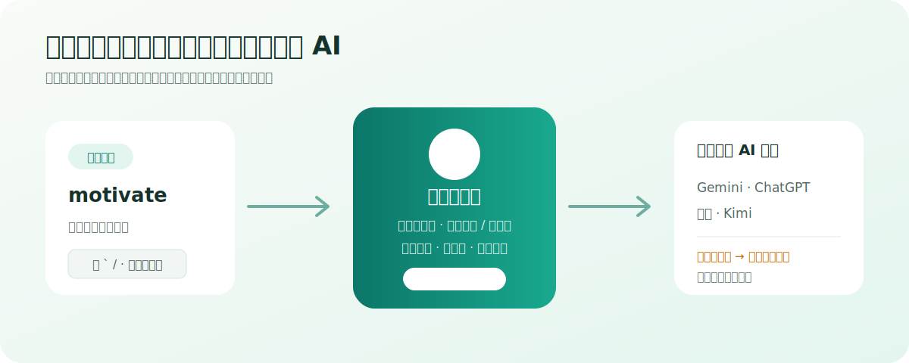

# Shanbay AI Word Bridge

English | [简体中文](README.md)

> Press one shortcut on Shanbay to send the current word or selected text to an already-open Gemini, ChatGPT, Doubao, or Kimi tab.




## Why it exists

The extension compresses the repetitive “copy word → switch tab → paste prompt → submit” loop into one shortcut without sacrificing delivery safety:

- It only uses providers that are enabled, permitted, and already open.
- Auto-send must be verified by an empty editor or a newly visible user message.
- An uncertain submission is never rerouted to another provider, preventing duplicates.

No developer API key is required. The extension automates AI web apps in which the user is already signed in.

## Supported providers

Gemini, ChatGPT, Doubao, and Kimi can be enabled, reordered, and configured independently. Each provider supports verified auto-send or fill-only mode and may prefer a saved conversation URL.

If the preferred conversation is not open, the dispatcher uses the most recently visited open tab for that provider. It never opens a new AI site on its own.

## Install

1. Download and extract the ZIP from [Releases](https://github.com/ddbbiii/shanbay-ai-word-bridge/releases).
2. Open `chrome://extensions` or `edge://extensions`.
3. Enable Developer mode and choose **Load unpacked**.
4. Select the extracted directory and approve the built-in site permissions.
5. Open extension settings to configure provider order, send modes, conversation URLs, and the shortcut.
6. Disable any previous Gemini-only userscript to avoid duplicate listeners.

To build from source:

```powershell
git clone https://github.com/ddbbiii/shanbay-ai-word-bridge.git
cd shanbay-ai-word-bridge
npm ci
npm run check
```

Load the generated `dist` directory.

## Use

1. Open Shanbay and at least one enabled AI provider.
2. Press the default <kbd>` / ·</kbd> key, or record another shortcut in settings.
3. Selected text wins; otherwise the extension detects the current Shanbay word.
4. The dispatcher writes the structured Chinese-learning prompt and submits it according to provider priority.

If no provider is available, the complete prompt is copied for use in Codex or any other AI.

## Delivery semantics

| Result | Meaning | Behavior |
| --- | --- | --- |
| `sent` | A new user message is visible or the editor cleared | Finish |
| `filled` | Fill-only mode completed | Leave content for the user |
| `not_ready` | No usable editor was found | User may reorder and retry |
| `not_submitted` | Content remains unsubmitted | User may confirm rerouting |
| `submission_unknown` | Submission may have happened | Never reroute; copy prompt |
| `permission_missing` | Host permission is unavailable | Skip provider |
| `failed` | Another adapter error occurred | Stop and copy prompt |

## Privacy

Settings and the last result stay in local browser storage. The extension stores no word history, uses no analytics or server, reads no Shanbay cookies, calls no private Shanbay API, and loads no remote code. See [PRIVACY.md](PRIVACY.md).

## Development

```powershell
npm run typecheck
npm test
npm run build
```

Provider adapters use semantic attributes and editor structure rather than button text alone. Selector changes should include updated DOM fixtures. See [adapter maintenance](docs/adapter-maintenance.md) and [CONTRIBUTING.md](CONTRIBUTING.md).

## License

[MIT](LICENSE)
